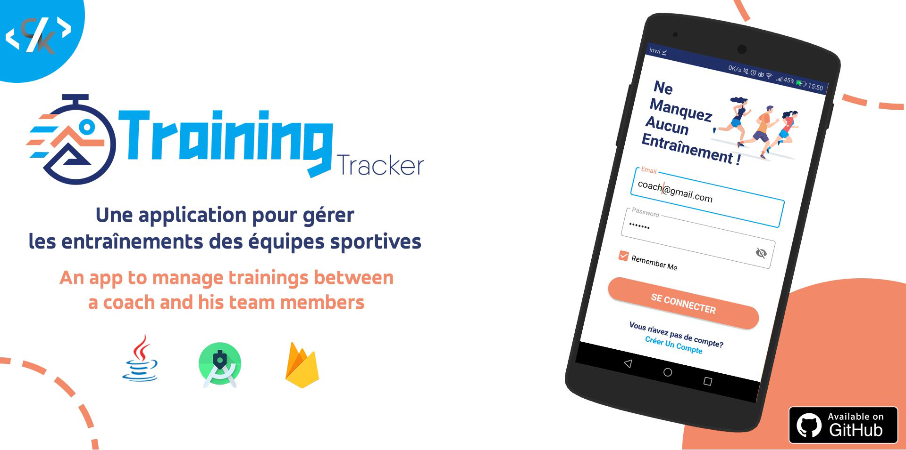
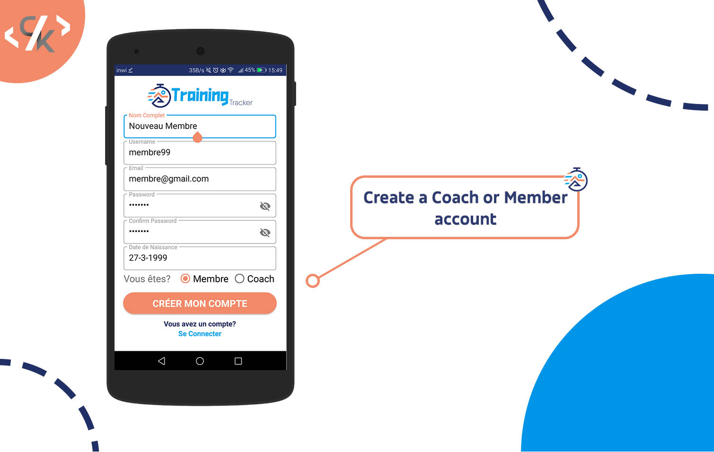
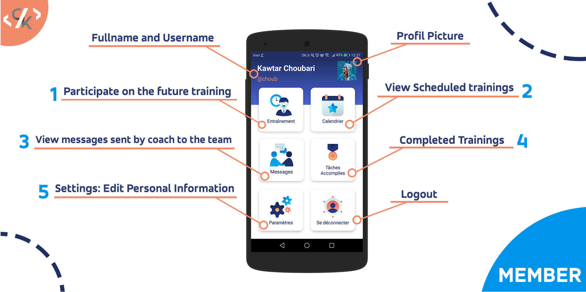
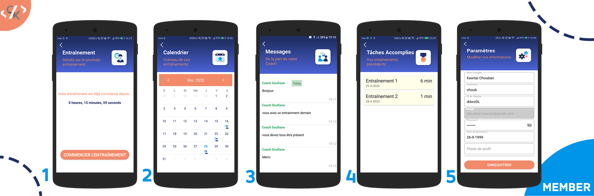
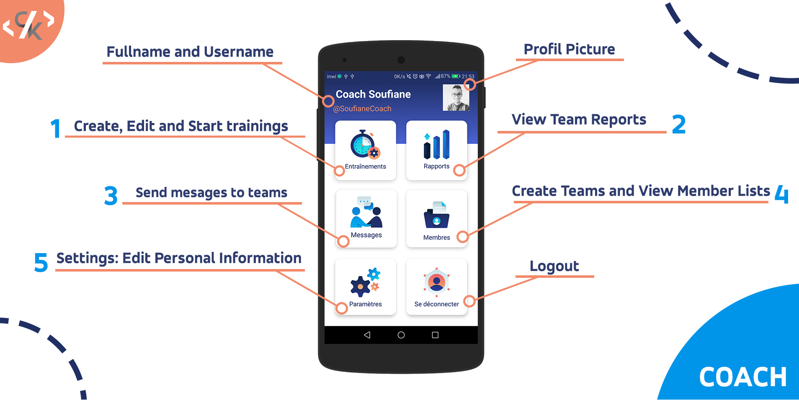
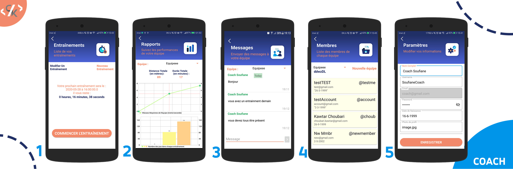
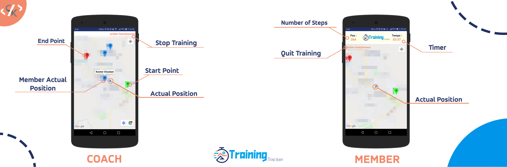

# :runner: TrainingTracker :running:
An android app to manage trainings between a coach and his team members. This is a school project for ENSIAS (National School of Applied Sciences in Rabat, Morocco) using Java and Firebase.

<p align="center">
  


##  :zap: Project Config

```
applicationId "com.choubapp.running"
compileSdkVersion 29
minSdkVersion 19
targetSdkVersion 29
```

## :key: Setup:

* Create a Firebase Project : Firebase [Setup and Documentation](https://firebase.google.com/docs/android/setup) for Android
* Get your own Google Maps [API Key](https://developers.google.com/maps/documentation/android-sdk/get-api-key) and add it to strings.xml 

We've used : 
* Firebase CloudFirestore to store users, teams and trainings data. 
* Realtime Database for sending and retreiving messages.
* Firebase Storage to save profil pictures uploaded by the users.


## :iphone: Screenshots :

**SignUp :**

<p align="center">
  

**:boy: Member Dashboard :**

<p align="center">
  


**Member Menus :**

<p align="center">
  

##

**:cop: Coach Dashboard :**

<p align="center">
  


**Coach Menus :**

<p align="center">
  

##

**:alarm_clock: Training Time :**

<p align="center">
  


## :bulb: External Libraries : 

[Picasso](https://github.com/square/picasso)

[Material Calendar View](https://github.com/Applandeo/Material-Calendar-View)

[MPAndroidChart](https://github.com/PhilJay/MPAndroidChart)

[FirebaseUI](https://github.com/firebase/FirebaseUI-Android)

##

### :sparkles: Graphic Assets :

Home Screen Illustration : [Freepik](https://freepik.com)

Gradient Icons : [Roundicons](https://roundicons.com/gradient-icons-pack/)

##

### :paperclip: Somethings to fix or add :

- [ ] Date picker Dialog isn't working for API 19-22
- [ ] Refactor the code to MVC architecture and optimize call Firebase functions.
- [ ] Push notifications to team members when the coach sends messages or the next training is near to start
- [X] Show date and time of each message

## :sparkling_heart: Support :

<a href="https://www.buymeacoffee.com/choubari" target="_blank"></a>


